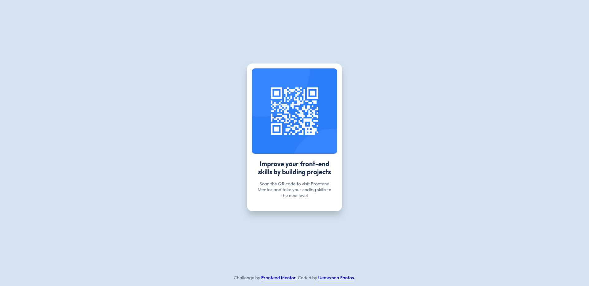

# Frontend Mentor - QR code component solution

This is a solution to the [QR code component challenge on Frontend Mentor](https://www.frontendmentor.io/challenges/qr-code-component-iux_sIO_H). Frontend Mentor challenges help you improve your coding skills by building realistic projects. 

## Table of contents

- [Overview](#overview)
  - [Screenshot](#screenshot)
  - [Links](#links)
- [My process](#my-process)
  - [Built with](#built-with)
  - [What I learned](#what-i-learned)
  - [Continued development](#continued-development)
  - [Useful resources](#useful-resources)
- [Author](#author)

## Overview

### Screenshot



### Links

- Solution URL: https://github.com/Neg0023/front-end-mentor-qr-code-challenge
- Live Site URL: https://neg0023.github.io/front-end-mentor-qr-code-challenge/

## My process

### Built with

- Semantic HTML5 markup
- CSS custom properties
- Flexbox


### What I learned

This challenge, besides being an easy one, was an opportunity to apply some of the theory I have learned over the past few months. Some of these concepts include flexbox, positioning elements on the page, and the basics of responsive layout. For example, I implemented CSS breakpoints to improve the page's visualization on different devices and screen widths.

One thing I've never understood well is the influence of the parent container's width on the responsiveness of its child elements. For example, defining a fixed width for a modal container and a variable width (based on percentages) for the QR code element allows the QR code element to adapt itself to the container, regardless of the screen size or device.

```css
.modal-container {
  width: 310px;
  /*...rest of the code*/
}

.modal-qr-code {
  max-width: 100%;
  /*...rest of the code*/
}
```

### Continued development

I have a lot to learn, and I'll keep focusing on learning positioning, flexbox, grid layout and responsiveness.

### Useful resources

- [CSS Flexbox Layout Guide](https://css-tricks.com/snippets/css/a-guide-to-flexbox/) - This helped me to apply some flexbox properties. This guide always helps me when I work with flexbox.
- [MDN - web developer doc](https://developer.mozilla.org/) - This is the place I go when I need to better understand of web tech, like html, javascript and css.

## Author

- Website - [Uemerson Santos](https://github.com/Neg0023)
- Frontend Mentor - [@Neg0023](https://www.frontendmentor.io/profile/Neg0023)
- Linkedin - [Uemerson Santos](https://www.linkedin.com/in/uemerson-santos/)